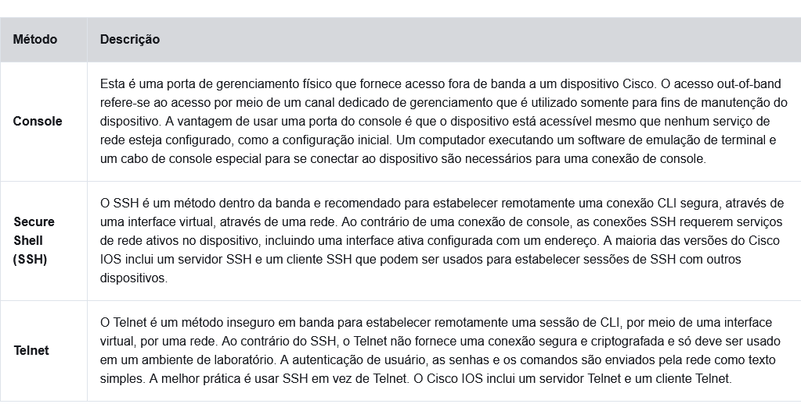

# Anotações baseadas no modulo 2 do curso da cisco (2.0 - 2.3)

# Acesso ao Cisco IOs

## Sistemas Operacionais

Todo computador, seja ele um dispositivo final ou não, necessita de um sistema operacional.
A parte do SO que interage diretamente com o hardware do computador, _se chama KERNEL_.
A parte que tem interface com aplicações para o usuário, _se chama SHELL_.
O usuário pode **interagir com a shell** por meio de uma _interface de linha de comando CLI (Interface de linha de Comando)_ ou uma _interface gráfica de usuário GUI (Interface Gráfica do Usuário)_.

Basicamente:

**Shell** - A interface de usuário que permite que os usuários solicitem tarefas específicas do computador. Essas solicitações podem ser feitas por meio da interface CLI ou GUI.
**Kernel** - comunica-se entre o hardware e o software de um computador e gerencia como os recursos de hardware são usados para atender aos requisitos de software.
**Hardware** - A parte física de um computador, incluindo os componentes eletrônicos subjacentes.

_A CLI_ exige menos do computador, por se tratar de uma interface que se baseia apenas em texto(códigos, comandos e etc), mas acaba exigindo que o usuário tenha conhecimento da estrutura de comando que controla o sistema.

## GUI

GUIs permitem que o usuário interaja mais facilmente co o sistema atráves do uso de janelas, ícones, menus e etc. Exemplos de GUI seriam linux, windows, macOS e etc.
As GUIs ajudam bastante os usuários mais leigos quanto ao funcionamento da estrutura de comando do sistema a navegarem por ele, mas nem sempre as GUIs tem todos os recursos que uma CLI
As CLI _consomem menos recursos e são muito mais estáveis_, em comparação com uma GUI.

**O sistema operacional nos roteadores domésticos geralmente é chamado firmware. O método mais comum para configurar um roteador residencial é usando uma GUI pelo navegador.**

## Objetivo de um SO

Um SO de rede baseado em CLI permite que um tecnico de rede faça o seguinte:

Use um teclado para executar programas de rede baseados na CLI;
Use um teclado para inserir texto e comandos baseados em texto;
Exibir a saída em um monitor.

Básicamente tarefas muito parecidas com o que um SO de computador comum permite.

Embora todos os dispositivos venham com o IOS e um conjunto de recursos padrão, é possível atualizar a versão do IOS ou do conjunto de recursos para obter mais capacidades.

## Metodos de Acesso

Switchs por natureza irão encaminhar o tráfego e não precisam necessáriamente ser configurados para operar, de qualquer forma **todos os switches devem ser configurados e protegidos**.

Note: Alguns dispositivos, como roteadores, também podem suportar uma porta auxiliar herdada usada para estabelecer uma sessão CLI remotamente por uma conexão telefônica usando um modem. De modo semelhante a uma conexão de console, a porta AUX é do tipo fora de banda e não requer serviços de rede para ser configurada ou estar disponível.

# Navegação IOS

## Modos de Comandos Primários

Esse capitulo cai abordar como configurar/navegar num SO de um sistema de redes com bas ena CLI (command line interface), baseando-se no SO que a cisco tem para seus dispositivos, sendo ele o Cisco IOs

Dito iss, para medidas de segurança o software Cisco IOS separa o acesso de gerenciamento em dois modos de comando:

 * **Modo EXEC de usuário**: Este modo possui recursos limitados, mas é útil para operações básicas. Ele permite apenas um número limitado de comandos de monitoramento básicos, mas não permite a execução de nenhum comando que possa alterar a configuração do dispositivo. O modo EXEC usuário é identificado pelo prompt da CLI que termina com o símbolo >.
 
 * **Modo EXEC privilegiado**: Para executar comandos de configuração, um administrador de rede deve acessar o modo EXEC privilegiado. Modos de configuração mais altos, como o modo de configuração global, só podem ser acessados do modo EXEC privilegiado. O modo EXEC privilegiado pode ser identificado pelo prompt que termina com o # símbolo.

[Metodos e prompts](../imagens/tabelaModosEPrompts.png)

## Modos de Configuração e SubConfiguração

O modo **Configuração Global** é o modo que permite _configurar os dispositivos de rede_, e seu funcionamento como um todo.
**OBS: Para indentificarmos que estamos no modo de configuração global, basta ver se no prompt a linha termina com _(config)#_** Exemplo: Swtich(config)#.

Nós acessamos modos de configuração mais específicos apartir do modo de configuração global, pois nele que inserimos modos de subConfiguração, cada modo de subConfiguração permite que nós configuremos uma parte específica do dispositivo.

Os dois modos comuns de subconfiguração são:
 * **Modo de configuração de linha**: Usado para configurar o acesso ao console, SSH, Telnet ou AUX.
 * **Modo de configuração da interface**: Usado para configurar uma porta de switch ou interface de rede do roteador.

Por padrão, todo prompt começa com após após o nome do dispositivo. Após o nome, o restante do prompt indica o modo.
EXs: o prompt padrão de configuração de linha é _Switch(config-line)#_ e para o modo interface _Switch(config-if)#._

### Como acessar esses metodos na CLI Do Cisco IOs

 * Para sairmos do modo EXEC usuário para privilegiado usamos o comando **enable**
 * Para irmos do Modo EXEC Privilegiado para o EXEC de usuário usamos **disable**
 * E para irmos do EXEC privilegiado pro global usamos **Configure Terminal**
 * Para entrarmos no modo de subConfiguração de interface usamos **interface (nome do componente)**
 * Para entrar no modo de subConfiguração de linha usamos **line ( tipo e número da linha de gerenciamento)**
 * Para sair do Modo global e de subConfiguração usamos o comando **exit**
 * E caso você queira sair das subConfiguração direto para o modo de EXEC privilegiado use **end**
 * E caso eu queira mover de um modo de subConfiguração para outro apenas selecionando a interface para qual eu quero  * mudar _EX: Switch(config-line)# interface FastEthernet 0/1 ---> Switch(config-if)#_

**OBS: O modo _EXEC privilegiado_ também é chamado de _enable mode_**

**OBS: para treinar esse tipo de configuração por console vale a pena usar _verificadores de sintáxe_**

# A estrutura de Comandos 

## Estrutura básica de Comandos do IOs

A imagem a seguir mostra a estrutra de sintaxe de um comando, sendo ela:
 * _comando_ 
 * _palavras-chave_: É um parâmetro específico definido no SO(na figura, protocolos ip) 
 * _argumentos_: Não são pré-definidos; estes são valores ou váriaveis definidos pelos usuários(na figura, 192.168.10.5)

[Estrutura dos Comandos](../imagens/estruturaComandos.png)

## Verificação de Sintaxe

Caso eu queira saber como um comando funciona eu posso pesquisar sua sintaxe, mas um resumo disso seria:
 * **Textos em Negritos** = comandos ou palavras-chave.
 * **Itálico** = Argumentos para o qual o usuário fornece valor.
 * **Colchetes** = Argumentos opcionais
 * **Chaves** = Elemento necessário

[Verificação de Sintaxe](../imagens/verificandoSintaxe.png)

**OBS: O comando description é comumente usado para indnetificar a finalidade de uma interface**

## Recursos de Ajuda do IOS

O IOS tem duas Formas de ajuda, _ajuda sensível ao contexto_ e _verificação da sintaxe do comando_.
A ajuda contextual ajuda a responder as seguintes perguntas:
 * Quais comandos estão disponíveis em cada modo de comando?
 * Quais comandos começam com caracteres específicos ou grupo de caracteres?
 * Quais argumentos e palavras-chave estão disponíveis para comandos específicos?

Sendo que a ajuda contextual, varia dependendo do modo que estamos na CLI, por exemplo se estivermos no modo EXEC privilegiado, e digitarmos "?" ele ira mostrar todos os comandos disponiveis para esse modo.

Se colocarmos alguns caracteres e depois a "?" a ajuda contextual vai mostrar todos os comandos que começam com esses caracteres.
E para sabermos **como completar um comando** como por exemplo, **saber seus argumentos** e etc, Basta digitarmos o _comando que queremos executar_, dar _um espaço_ e depois _colocar "?"_, que o CLI te mostrara qual o próximo parâmetro. 
_EX: interface ?_

Para _acessar a ajuda contextual_, basta apenas **digitar "?" no CLI**.

## Alguns Atalhos e teclas de atalho do CLI do IOS

O CLI do IOS permite que abreviemos comandos e palavras chaves, usando o numero minimo de caracteres que indentificam aquele comando. _EX: configure ---> conf_
Isso ocorre pois o comando configure é o único programa que começa com config.
Seguindo a lógica acima palavras chaves também podem ser abreviadas assim.

Quando o teminal IOS imprimir um _texto que ultrapasse o tamanho da tela_ ele exibirá um **--more--** para avançar e ver a parte do texto que está além do more, **basta apertar a barra de espaço**.

### Tabelas com atalhos de teclado

[Atalhos de Teclado](../imagens/tabelaAtalhos.png)

**OBS: A estruture de comando IOS não reconhece a tecla _delete_**

A tabela a seguir mostra atalhos para sair de operações:

[Tabela para sair de operações](../imagens/tabelaComandos2.png)