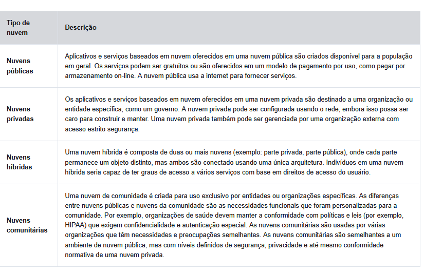

# Continuação do curso da cisco a partir do cap 1.7

## Falando de Tendências

### BYOD (Bring Your own Device)

O BYOD permite aos usuários finais a liberdade de usar ferramentas pessoais para acessar informações e se comunicar através de uma rede comercial ou do campus.
BYOD significa o uso de qualquer dispositivo, de qualquer propriedade e em qualquer lugar.

### Colaboração Online

As pessoas querem se conectar à rede não só para acessar as aplicações de dados, mas também para colaborar com outras pessoas. 
As ferramentas de colaboração, oferecem aos funcionários, alunos, professores, clientes e parceiros uma maneira de conectar, interagir e alcançar instantaneamente seus objetivos.
A colaboração é uma prioridade crítica e estratégica que as organizações estão usando para permanecer competitivas. A colaboração também é uma prioridade na educação.

### Comunicações Em Vídeo

O vídeo é usado para comunicação, colaboração e entretenimento.
A videoconferência é uma ferramenta poderosa para se comunicar com outras pessoas, local e globalmente. O vídeo está se tornando um requisito fundamental para a colaboração efetiva à medida que as empresas se expandem pelos limites geográficos e culturais.

## Computação em Nuvem

A computação em nuvem é uma das maneiras pelas quais acessamos e armazenamos dados, permitindo assim guardar arquivos e etc em servidores da internet, e até acessar softwares e programas.

Para as empresas, a computação em nuvem amplia os recursos de TI sem exigir investimento em nova infraestrutura, treinamento de novas equipes ou licenciamento de novo software

A computação em nuvem é possível devido aos data centers. Os data centers são instalações usadas para hospedar sistemas de computador e componentes associados.

Para segurança, confiabilidade e tolerância a falhas, os provedores de nuvem geralmente armazenam dados em data centers distribuídos.

#### Os 4 principais tipos de nuvem

## Tendencias tecnologicas em casa

As mais novas tendências para casas incluem a “tecnologia residencial inteligente”.

A tecnologia de casa inteligente se integra aos aparelhos diários, que podem ser conectados a outros dispositivos para tornar os aparelhos mais “inteligentes” ou automatizados.
Atualmente, a tecnologia de casa inteligente está sendo desenvolvida para todos os cômodos de uma casa. A tecnologia doméstica inteligente se tornará mais comum à medida que as redes domésticas e a tecnologia de Internet de alta velocidade se expandirem.

## Rede PowerLine

A rede Powerline para redes domésticas usa a fiação elétrica existente para conectar dispositivos.

Usando um adaptador padrão powerline, os dispositivos podem se conectar à LAN onde quer que haja uma tomada elétrica. Nenhum cabo de dados precisa ser instalado, e há pouca ou nenhuma eletricidade adicional usada.

Usando a mesma fiação que fornece a eletricidade, a rede powerline envia informações ao enviar dados em determinadas frequências.

A rede Powerline não substitui o cabeamento dedicado em redes de dados. No entanto, é uma alternativa quando os cabos da rede de dados ou as comunicações sem fio não são possíveis ou eficazes.

## Banda Larga sem Fio

### Provedor de serviços de internet sem fio

#### WISP
Um provedor de serviços de Internet sem fio (WISP) é um provedor de serviços de Internet que conecta assinantes a um ponto de acesso ou hot spot designado usando tecnologias sem fio semelhantes encontradas em redes locais sem fio domésticas (WLANs).

**Como funciona o WISP**:
Embora uma torre de transmissão separada possa ser instalada para a antena, normalmente a antena está conectada a uma estrutura elevada existente, como uma torre de água ou uma torre de rádio. Uma antena parabólica pequena ou grande é instalada no teto do assinante dentro do alcance do transmissor WISP. A unidade de acesso do assinante é conectada à rede com fio dentro de casa.

#### Banda larga sem fio

Esta solução usa a mesma tecnologia celular que um telefone inteligente. Uma antena é instalada fora da residência, fornecendo conectividade com ou sem fio para dispositivos na casa. Em muitas áreas, a banda larga sem fio doméstica está competindo diretamente com serviços DSL e a cabo.

## Segurança das redes

A segurança da rede deve considerar o ambiente, bem como as ferramentas e os requisitos da rede. Ele deve poder proteger os dados e, ao mesmo tempo, permitir a qualidade do serviço que os usuários esperam da rede.

A proteção de uma rede envolve protocolos, tecnologias, dispositivos, ferramentas e técnicas para proteger dados e mitigar ameaças. Vetores de ameaça podem ser internos ou externos.

Também é importante considerar ameaças internas. Há muitos estudos que mostram que as violações mais comuns ocorrem por causa de usuários internos da rede. Isso pode ser atribuído a dispositivos perdidos ou roubados, mau uso acidental por parte dos funcionários e, no ambiente comercial, até mesmo funcionários mal-intencionados.

### Ameaças

* _Vírus, worms e cavalos de Tróia_ - Eles contêm software ou código malicioso em execução no dispositivo do usuário.

* _Spyware e adware_ - Estes são tipos de software que são instalados no dispositivo de um usuário. O software, em seguida, coleta secretamente informações sobre o usuário.

* _Ataques de dia zero_ - Também chamados de ataques de hora zero, ocorrem no primeiro dia em que uma vulnerabilidade se torna conhecida.

* _Ataques de ator de ameaça_ - Uma pessoa mal-intencionada ataca dispositivos de usuário ou recursos de rede.

* _Ataques de negação de serviço_ - Esses ataques atrasam ou travam aplicativos e processos em um dispositivo de rede.

* _Interceptação de dados e roubo_ - Esse ataque captura informações privadas da rede de uma organização.

* _Roubo de identidade_ - Esse ataque rouba as credenciais de login de um usuário para acessar informações privadas.

### Soluções de Segurança

Nenhuma solução única pode proteger a rede da variedade de ameaças existentes. Por esse motivo, a segurança deve ser implementada em várias camadas, com uso de mais de uma solução.

Uma implementação de segurança para redes domésticas é normalmente bastante básica. Normalmente, você o implementa nos dispositivos finais, bem como no ponto de conexão com a Internet, e pode até confiar nos serviços contratados pelo ISP.

Estes são os componentes básicos de segurança para uma rede doméstica ou de pequeno escritório:

* _Antivirus e antispyware_ - Esses aplicativos ajudam a proteger os dispositivos finais contra a infecção por software malicioso.
* _Filtragem por firewall_ - A filtragem por firewall bloqueia o acesso não autorizado dentro e fora da rede. Isso pode incluir um sistema de firewall baseado em host que impede o acesso não autorizado ao dispositivo final ou um serviço básico de filtragem no roteador doméstico para impedir o acesso não autorizado do mundo externo à rede.

Já a implementação de segurança para uma rede corporativa geralmente consiste em vários componentes incorporados à rede para monitorar e filtrar o tráfego. Idealmente, todos os componentes trabalham juntos, o que minimiza a manutenção e melhora a segurança.

* _Sistemas de firewall dedicados_ - Eles fornecem recursos de firewall mais avançados que podem filtrar grandes quantidades de tráfego com mais granularidade.
* _Listas de controle de acesso (ACL)_ - Eles filtram ainda mais o acesso e o encaminhamento de tráfego com base em endereços e aplicativos IP.
* _Sistemas de prevenção de intrusões (IPS)_ - Identificam ameaças de rápida disseminação, como ataques de dia zero ou hora zero.
* _Redes privadas virtuais (VPN)_ - Fornecem acesso seguro a uma organização para trabalhadores remotos.

As soluções de segurança implementadas devem ser adaptáveis às tendências de crescimento e variáveis da rede.

